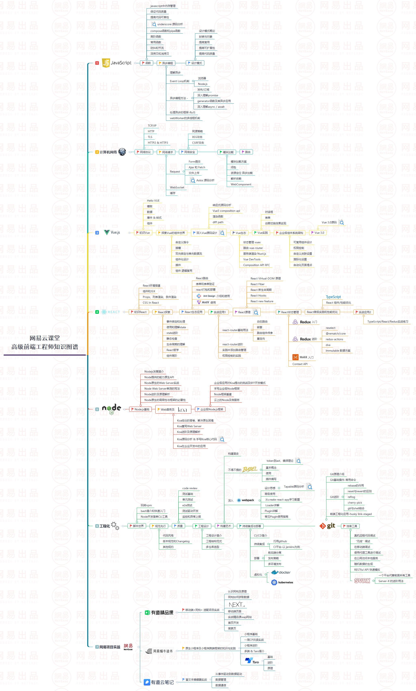

# 维护一份属于自己的知识文档

今天学一点，后天学一点，间歇性的热爱学习很正常，但回过头来东西都不是你的，先规划，后记录整理，坚持维护，才能清楚的知道自己的水平

看到自己的成长，才能安心，不迷茫

# 规范化

* 开源项目目录规范
* Javascript 编码规范
* CSS 编码规范
* HTML 编码规范
* Markdown 编写规范

**[百度前端研发部](https://github.com/fex-team/styleguide)**

# 学习大纲

</img>
 
## javaScript基础

1. **[淘宝--冴羽](https://github.com/mqyqingfeng/Blog)**

2. **[哈喽--木易杨](https://github.com/Advanced-Frontend/Daily-Interview-Question)**

3. **[函数式编程工具库underscore中文文档](http://www.underscore-js.com/functionsRelated.html)**

## 计算机网络

1. 图解tcp/ip

## vue源码

1. **[didi--黄奕](https://github.com/ustbhuangyi/vue-analysis)**

# 前端工程化

1. webpack --- 直接上官网

2. nginx

3. docker

# 学习成果验证法

多做面试题，每一道面试题背后都会有一个知识点，去深入的了解学习

# 费曼学习法(适合任何专业)

以教促学，一个人学东西很枯燥的，以平等的姿态去多交流，多传授，才能巩固自己知识体系

# 课外书（学术类）

1. 《刻意练习》

2. 《终身成长》

3. 《即兴演讲》